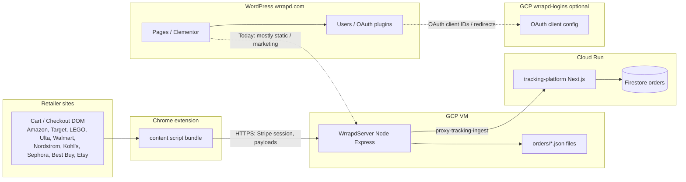

# Integration map: Chrome extension, pay/API server, tracking, WordPress

High-level map of how the major pieces talk today, and where **customer identity** and **order history** should be joined for the “guest → account → see all orders” feature.

**Solid lines:** implemented data paths in the monorepo direction.  
**Dotted lines:** partial, manual, or **to be built** (WordPress “Review Wrrapd Orders” backed by server-side order list).

---

## Domains and processes (canonical)

| Host / process | Repo path | Notes |
|----------------|-----------|--------|
| `api.wrrapd.com`, `pay.wrrapd.com` | `backend/wrrapd-api-repo/WrrapdServer/server.js` | PM2 name **`wrrapd-server`**. CORS allows retailer extension origins; Stripe checkout; saves orders under `orders/`. |
| Tracking ingest | Same server → `POST /api/proxy-tracking-ingest` (see `TRACKING_INGEST_URL`) | Forwards to Cloud Run `…/api/orders/ingest` with shared secret header. |
| Tracking UI | `tracking-platform/` | Firestore-backed orders; admin/driver/public track routes. |
| `wrrapd.com` | **Not** in this git repo | WordPress + Elementor + plugins; production DB tables commonly prefixed `dfy_`. |

---

## Key HTTP surfaces (WrrapdServer)

Exact paths evolve; always confirm in `server.js` before documenting externally. Representative endpoints include:

- **`POST /create-checkout-session`** — body includes `total`, `orderNumber`, `customerEmail` (used for Stripe customer email when valid).
- **`GET /api/checkout-session-complete`** — completes Stripe session, persists order JSON via `saveOrderToJsonFile`, triggers downstream email / ingest logic (see file for full flow).
- **`POST /api/proxy-tracking-ingest`** — authenticated ingest toward tracking platform.
- **`POST /api/save-ai-design`**, **`POST /api/get-upload-url`**, **`POST /api/store-final-shipping-address`** — media and address pipeline supporting checkout.

---

## Tracking platform ingest

- **Route:** `tracking-platform/src/app/api/orders/ingest/route.ts`
- **Parser / schema:** `tracking-platform/src/lib/order-ingest.ts` — accepts `customerEmail`, nested `buyer.email`, `orderNumber`, addresses, line items, Amazon delivery grouping hints, etc.
- **Storage:** `tracking-platform/src/lib/data.ts` — Firestore collection `orders` when Firebase admin is configured; otherwise local JSON fallback under `.data/orders.json` (development).

Any “list my orders” feature for end users should **reuse the same normalized fields** ingest already understands (`customerEmail` / `buyer.email`), to avoid inventing a parallel schema.

---

## WordPress (`wrrapd.com`)

- **Auth / “Logins” GCP project:** Google Cloud project **Wrrapd-Logins** (`wrrapd-logins`) typically holds OAuth **client IDs** and related GCP resources. WordPress plugins (Google / Amazon login) reference those credentials; they do **not** by themselves copy order rows into MySQL.
- **Marketing / Elementor:** Homepage, welcome page, and Hello Elementor **Additional CSS** live in the WP database (`dfy_posts`, `dfy_postmeta`), not in this monorepo. Changes made via MCP or WP admin should be **logged** in [`WORDPRESS-SITE-EDITS-LOG.md`](WORDPRESS-SITE-EDITS-LOG.md).

### Target integration for “Review Wrrapd Orders”

1. User is authenticated in WordPress (`is_user_logged_in()`).
2. **Implemented (repo):** MU plugin **`wordpress/wrrapd-orders-bridge.php`** — on **`wp_login`** / **`user_register`** calls **`POST /api/internal/claim-orders-by-email`**; shortcode **`[wrrapd_review_orders]`** calls **`POST /api/internal/orders-for-wp-user`**. Both use header **`X-Wrrapd-Internal-Key`** (same secret as **`WRRAPD_INTERNAL_CLAIM_SECRET`** on the pay server). Body always includes **`wpUserId` + `email`** so the list endpoint cannot be abused with user id alone.
3. Response JSON drives the shortcode table on the Elementor page behind the button.

Never expose the internal key in Elementor HTML or browser JavaScript.

---

## Extension source layout (monorepo)

| Path | Role |
|------|------|
| `extension/src/content/index.js` | **Amazon** entry; bundled to root `extension/content.js` (`npm run build:amazon`). |
| `extension/src/content/<retailer>-index.js` | Store-retailer entries for **Target, LEGO, Ulta, Walmart, Nordstrom, Kohl's, Sephora, Best Buy, Etsy**; bundled to `extension/content-<retailer>.js`. Must stay independent of Amazon legacy. |
| `extension/src/content/content-legacy.js` | Amazon-only legacy flow (checkout monitoring, pay handoff, etc.). |
| `extension/src/content/lib/` | Modules imported by the **Amazon** entry (sign-in heuristics, delivery hints, DOM helpers, etc.). |
| `extension/src/retailers/` | Per-retailer constants/adapters and DOM selectors. Shared store behavior lives in `extension/src/shared/`. |

`npm run build` produces all retailer bundles; `manifest.json` uses **separate `content_scripts`** so only the matching retailer code runs on each host. Full framework, CWS notes, and naming (`content.js` vs `content-<retailer>.js`): **[extension/README.md](../extension/README.md)** and **[docs/EXTENSION-ARCHITECTURE.md](EXTENSION-ARCHITECTURE.md)**.

The Amazon bundle’s job is to **complete Amazon checkout** and **invoke** pay server and ingest paths with consistent **order numbers**, **`retailer: Amazon`**, and **customer email** when available. Store-retailer bundles use the same API patterns with the correct **`retailer`** on payment and ingest, then release the real retailer checkout/place-order button after Wrrapd payment succeeds.

Store-retailer safety rules:

- Cart extraction must count real cart/bag lines only, not recommendation/sponsored/related products.
- Delivery-date capture must ignore stale dates before today; when uncertain, emails and orders fall back to generic “retailer delivery date + 1 day” wording.
- Kohl's intentionally skips concrete delivery-date capture because shoppers can change shipping speed/expedite.

---

## Related documents

- [`CUSTOMER-ACCOUNTS-AND-ORDER-HISTORY.md`](CUSTOMER-ACCOUNTS-AND-ORDER-HISTORY.md) — product + data model + DB choice.
- [`WORDPRESS-SITE-EDITS-LOG.md`](WORDPRESS-SITE-EDITS-LOG.md) — changelog of site edits.
